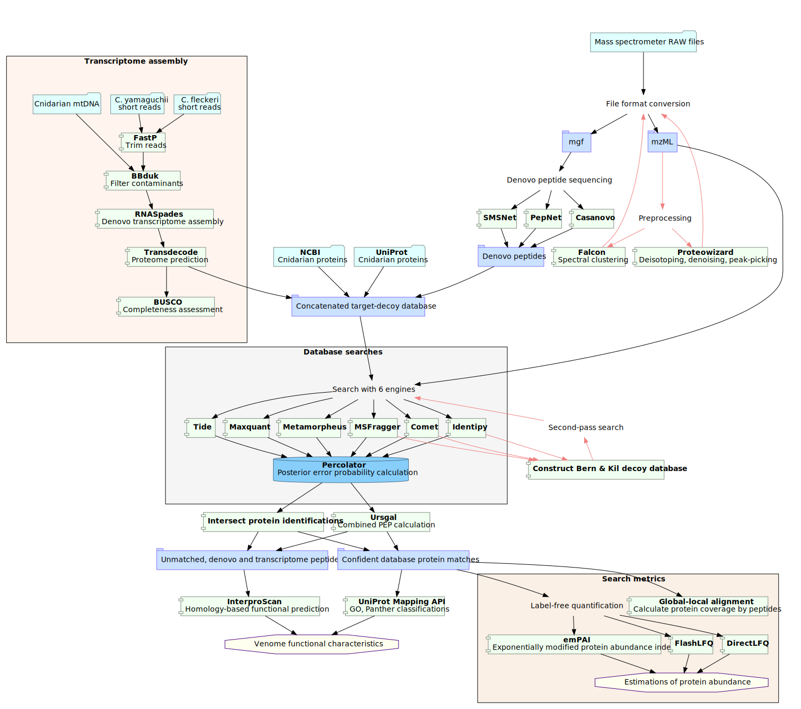

```{r setup, include=FALSE, echo=FALSE}
knitr::opts_chunk$set(
  warning = FALSE, message = FALSE, echo = FALSE,
  dev = "svg",
  # eval = FALSE
)
```

```{r echo=FALSE, results='hide', message=FALSE, comment=NA}
source("../bin/get_metrics.r")
library(MSnbase)
library(Spectra)
library(DiagrammeR)
plot_mw_dist <- function(combined_table) {
  combined_table %>% ggplot(aes(x = mw, y = engine, fill = engine)) +
    ggridges::geom_density_ridges2()
}
plot_len_dist <- function(combined_table) {
  combined_table %>% ggplot(aes(x = length, y = engine, fill = engine)) +
    ggridges::geom_density_ridges2()
}
```

```{r, echo=FALSE}
args <- c("~/CiCs1.mzML", "../results/CiCs_metrics.tsv")
input <- args[1]
all_data <- openMSfile(input) # This reads all information from the mzml
#   file by default
all_headers <- all_data %>%
  header() %>%
  as_tibble()
tic <- chromatogram(readMSData(input, mode = "onDisk"))
```

```{r, echo=FALSE}
ms1 <- which(all_headers$msLevel == 1)
selected_rt <- all_headers$retentionTime[ms1] / 60 > 40 & all_headers$retentionTime[ms1] / 60 < 45
ms1_all <- all_headers %>%
  filter(msLevel == 1) %>%
  as_tibble()
M <- MSmap(all_data, ms1[selected_rt], 500, 503, 0.05, all_headers, zeroIsNA = TRUE)
svg("3dimensional.svg")
plot3D(M)
dev.off()
```

#### MS/MS spectra

```{r, echo=FALSE}
# Plot spectra
ms2 <- Spectra(input) %>% filterMsLevel(2)
sample <- ms2[1:4]
names <- paste0("Precursor m/z: ", sample$precursorMz)
svg("sample_msms.svg")
plotSpectra(sample, main = names, col = "darkgreen")
dev.off()
```

#### Bioinformatics
* **Three data processing procedures**
  * Peptide identification: identifying the sequence of the peptide ion that gave rise to a given MS/MS spectra
  *

## Pipeline implementation



#### Distribution of identified proteins by engine
```{r, echo=FALSE}
map <- "../tests/toy_results/all_normal_mapping.tsv"
file_path <- "../results/ND_jellyfish/1-First_pass/Percolator"
all_psms <- get_tables(file_path, TRUE, 0.05, map)
all_proteins <- get_tables(file_path, FALSE, 0.05, map)
psm_mw_dist <- plot_mw_dist(all_psms)
psm_len_dist <- plot_len_dist(all_psms)
protein_mw_dist <- plot_mw_dist(all_proteins)
protein_len_dist <- plot_len_dist(all_proteins)
```

#### Distribution of identification results
```{r, echo=FALSE}
# Is the difference between distributions statistically significant?
engines <- unique(all_proteins$engine)
engine_combos <- engines %>% combn(2)
for (comb in seq_len(dim(engine_combos)[2])) {
  first <- engine_combos[, comb][1]
  second <- engine_combos[, comb][2]
  first_df <- all_proteins %>% filter(engine == first)
  second_df <- all_proteins %>% filter(engine == second)
  try <- ks.test(first_df$mw, second_df$mw)
  if (try$p.value < 0.05) {
    print(glue("SSD found! {first} & {second}, p = {try$p.value}"))
  }
}
```

#### Overlap of engines' identified prteins
```{r, echo=FALSE}
id_list <- lapply(engines, function(x) {
  return(filter(all_proteins, engine == x)$id)
}) %>% `names<-`(engines)
big_venn <- venn(id_list,
  plotsize = 35, borders = FALSE, box = FALSE,
  ilcs = 1.5, sncs = 2,
  zcolor = "red, blue, green, white, orange, yellow"
)
svg("engine_intersections.svg")
big_venn
dev.off()
```


